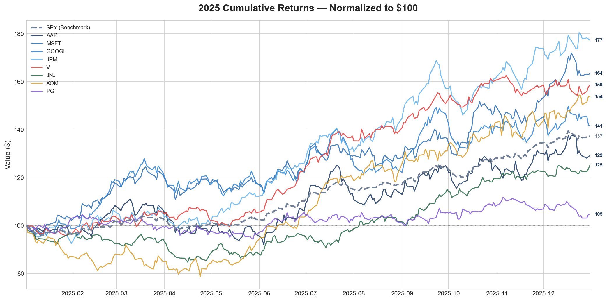
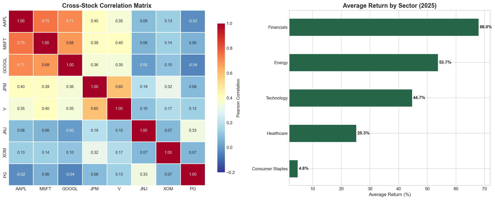
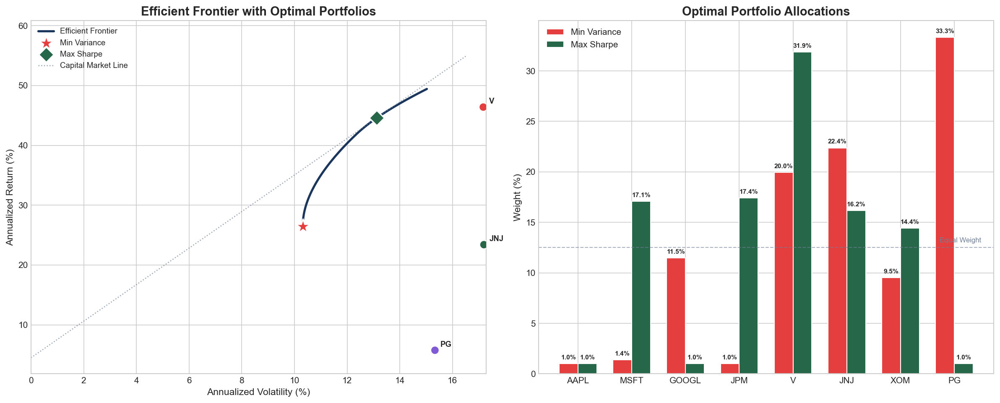
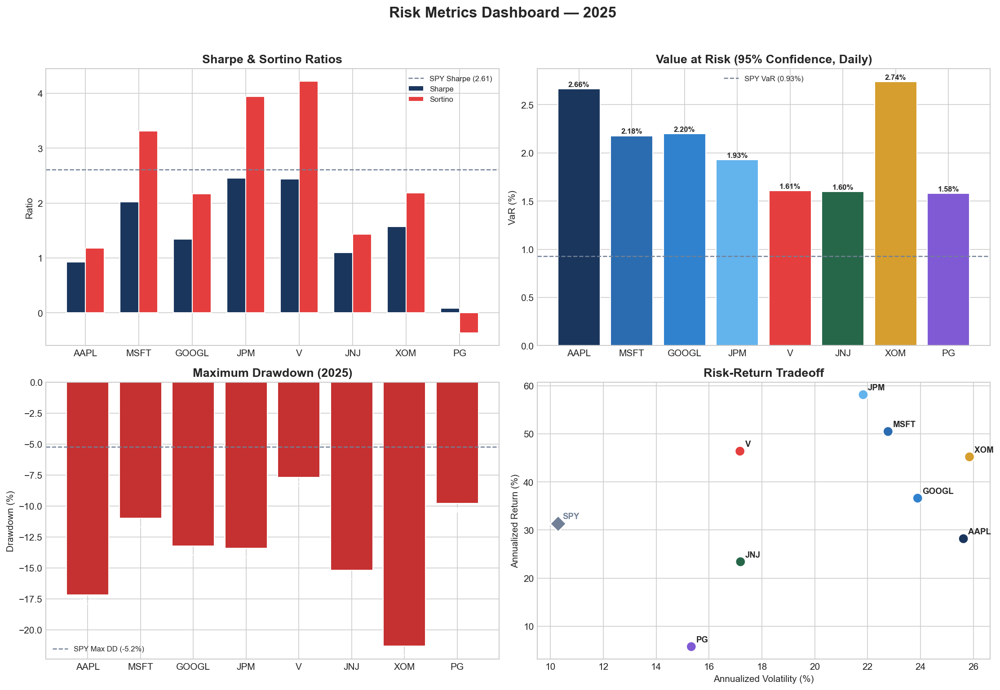
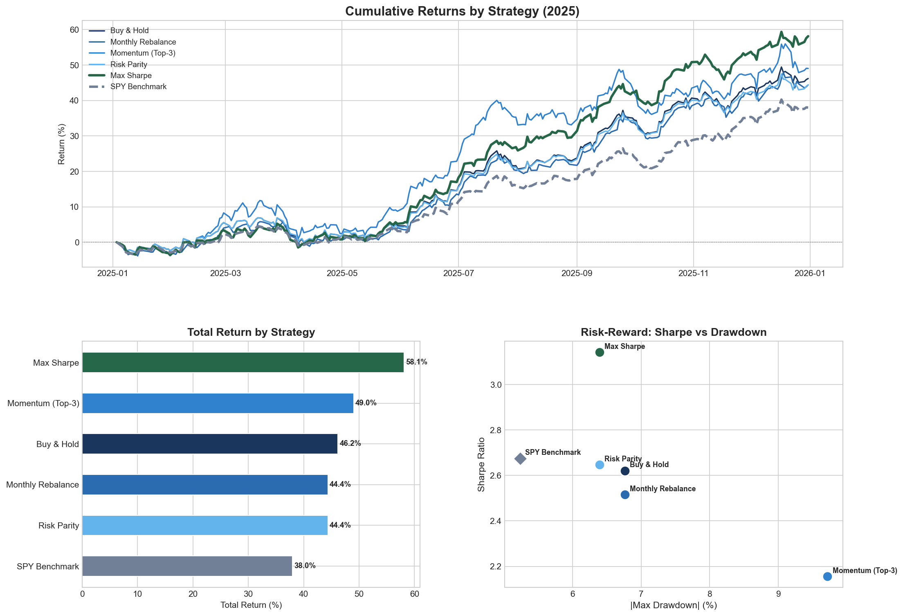
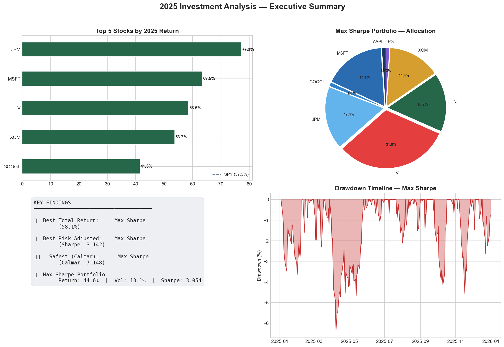

# 📊 Stock Performance & Investment Analysis (2025)

**Portfolio Optimization · Risk-Adjusted Returns · Investment Strategy Comparison · Financial Modeling**

---

## Overview

I built this project to combine the SQL and Python skills I've been developing in class with something I actually find interesting — financial modeling. The idea is to analyze stock performance across a few sectors, then build and optimize real portfolios using Markowitz theory, and finally backtest a handful of different trading strategies to see which one actually wins on a risk-adjusted basis.

It covers the full workflow: ingesting data into a SQL database, exploratory analysis, portfolio optimization with constrained solvers, a full suite of risk metrics, and strategy backtesting with visualizations.

---

## Tech Stack

| Tool | Usage |
|------|-------|
| **Python 3** | Core analysis engine |
| **pandas / NumPy** | Data manipulation & numerical computation |
| **SciPy** | Portfolio optimization (constrained minimization) |
| **SQLite (via sqlite3)** | Structured data storage & aggregation queries |
| **Matplotlib / Seaborn** | Financial dashboards & visualizations |

---

## Notebook Sections

| # | Section | What I did |
|---|---------|------------|
| 1 | **Setup & Configuration** | Defined the stock universe, risk-free rate, and color palette |
| 2 | **Data Acquisition** | Simulated correlated returns using Cholesky decomposition + ran validation checks |
| 3 | **SQL Database Layer** | Built a normalized SQLite schema and wrote 4 business queries |
| 4 | **Exploratory Analysis** | Plotted normalized cumulative returns vs SPY |
| 5 | **Correlation & Sector** | Heatmap of cross-stock correlations + sector-level return breakdown |
| 6 | **Portfolio Optimization** | Solved for min-variance and max-Sharpe portfolios, traced the efficient frontier |
| 7 | **Risk Metrics** | Sharpe, Sortino, VaR, Max Drawdown, and Calmar for every stock |
| 8 | **Strategy Comparison** | Backtested 5 strategies end-to-end |
| 9 | **Executive Summary** | One-page dashboard pulling together the key findings |

---

## Results & Analysis

Here's a walkthrough of what I found at each stage

### Stock Performance



- **JPM was the clear winner at 77.3%** — more than double SPY's 37.3%. Financials as a sector averaged 68%, which was the biggest takeaway from the EDA phase.
- Every stock in my universe except PG beat the benchmark. PG returned only 4.8% — low, but that turned out to be strategically useful later in the optimization.
- The cumulative returns chart normalizes everything to $100 at the start so you can compare apples to apples. JPM and MSFT pulled away from the pack starting around mid-year and never looked back.

### Correlation Structure



- **Tech stocks cluster tightly** — AAPL/MSFT at 0.75, AAPL/GOOGL at 0.71. If one moves, the others follow. That's important because it means holding all three doesn't diversify you as much as it looks like it does.
- **PG is basically uncorrelated with everything** — correlations ranging from -0.02 to 0.13 across the board. That's exactly the kind of name a portfolio optimizer wants to own for diversification, even if the return is low.
- JPM and V pair up at 0.60, which makes sense — they're both financials riding similar macro tailwinds.

### Portfolio Optimization



- The **Min Variance portfolio** loaded up on PG (33.3%) and JNJ (22.4%) — the two lowest-vol, lowest-correlation names. Classic defensive tilt. It achieved a Sharpe of 2.13 with only 10.3% volatility.
- The **Max Sharpe portfolio** made a very different bet: V at 31.9%, JNJ at 22.4%, JPM at 17.4%. It was chasing the best risk-adjusted return, not the lowest risk. Sharpe came in at 3.05 — a meaningful jump.
- The gap between those two portfolios is the interesting part. Min Variance and Max Sharpe are telling two completely different stories about what "optimal" means, and the efficient frontier shows exactly where the tradeoff lives.
- I capped each stock at 40% to keep the portfolios realistic — no single-stock concentration.

### Risk Metrics



- **JPM had the best risk-adjusted returns** among individual stocks — Sharpe of 2.46, Sortino of 3.94. It wasn't just the highest return; it was also earning that return efficiently.
- **AAPL had the worst single-day VaR at 2.66%** — on a bad day, that's the kind of loss you'd expect at the 95% confidence level. XOM was similar at 2.74%.
- **XOM had the scariest max drawdown at around -20%** — the deepest hole any stock fell into during the year. That's a big number for a single position.
- PG's Sharpe and Sortino were basically flat near zero. Almost no risk, almost no reward. But again — that's the diversification play, not the return play.
- The bottom-right scatter (Risk-Return Tradeoff) is my favorite quick view. Stocks in the upper-left are the ones you actually want: high return, low vol. JPM and MSFT both sit there.

### Strategy Backtesting



- **Max Sharpe won on every metric that mattered** — best total return (58.1%), best Sharpe (3.142), best Calmar (7.148). The optimized weights from Markowitz actually translated into real backtest performance.
- **Momentum was the most interesting failure mode.** It posted the second-best return at 49%, but it had the worst max drawdown (~9.5%) and the lowest Sharpe of any active strategy. Chasing trailing winners works — until it doesn't, and when it stops working it stops hard.
- Monthly Rebalance and Risk Parity basically tied at 44.4%. Rebalancing back to equal weight each month didn't add much over just buying and holding. Risk Parity was smarter about allocation but didn't translate that into meaningfully better returns here.
- **Every single active strategy beat SPY (38%).** The benchmark was the floor, not the ceiling.

### Executive Summary



- The Max Sharpe portfolio's drawdown timeline (bottom-right) shows it never dropped more than about 6.4% from any peak. That's a pretty controlled ride for a portfolio that returned 58%.
- The pie chart shows the final Max Sharpe allocation — V dominates, but there's real diversification across the other names. It's not a one-stock bet.

---

## Key Techniques

**Portfolio Optimization** — Markowitz Mean-Variance with long-only constraints (1%–40% per stock). Efficient frontier generated via iterative constrained optimization using SciPy's SLSQP solver. Capital Market Line overlaid for visual Sharpe interpretation.

**Risk Metrics** — Sharpe, Sortino (downside-only), Historical VaR at 95%, Max Drawdown, Calmar Ratio. Computed for every individual stock and every backtested strategy.

**Data Simulation** — Cholesky decomposition to generate correlated multi-asset daily returns. The correlation structure is sector-aware: tech stocks cluster, defensives stay isolated.

**SQL Layer** — Normalized 3-table schema (prices, metadata, returns). Wrote 4 business queries including a correlated subquery to find the top performer each quarter.

---

## How to Run

```bash
git clone <repo-url>
cd stock-analysis
pip install pandas numpy scipy matplotlib seaborn nbformat
jupyter notebook stock_analysis.ipynb
```

**Swapping in real data:** Replace the simulation block in Section 2 with:
```python
import yfinance as yf
df_prices = yf.download(TICKERS + ['SPY'], start='2025-01-01', end='2025-12-31')['Close']
```

---

## Skills Demonstrated

- SQL querying and relational data management
- Financial modeling (Markowitz optimization, risk metrics)
- Constrained optimization with SciPy
- Time-series analysis and strategy backtesting
- Data validation and reproducibility
- Business-ready visualization and executive dashboards
